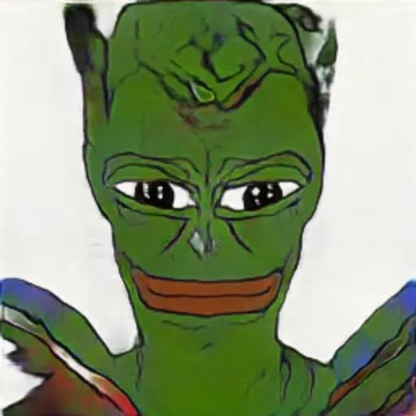
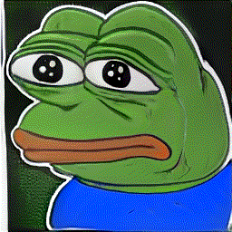
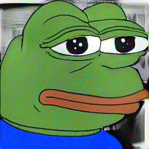
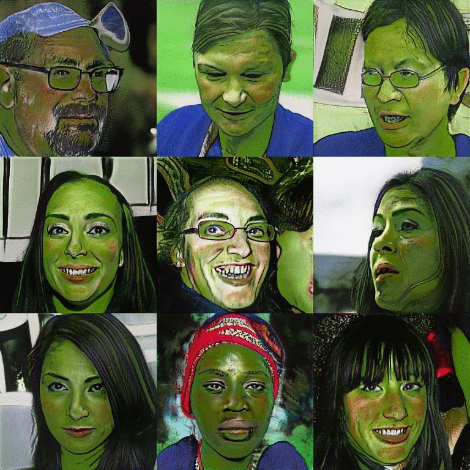

# Selfie to Pepe (ODS pet project hackathon)

##### [telegram: @ods_sticker_pack_bot](https://t.me/ods_sticker_pack_bot) | [pepe datasets](https://drive.google.com/drive/folders/1A5lvBdknNP2qZ8ySwV7u-gbZA7graSsE?usp=sharing)

 Send your selfie and get Pepe version of yourself

### Example

<div>
    <table>
        <tr>
            <td>
                <h2>Selfie input</h2>
            </td>
            <td>
                <h2>Pepe output</h2>
            </td>
        </tr>
        <tr>
            <td></td>
            <td></td>
        </tr>
    </table>    
</div>


## How it works
* We detect the face on the image via `dlib` library then align and reshape it
* We apply [pix2pix model](https://github.com/junyanz/pytorch-CycleGAN-and-pix2pix) to generate the output image.

## How it was trained
##### Step 1
Using the results of the paper
["Differentiable Augmentation for Data-Efficient GAN Training"](https://hanlab.mit.edu/projects/data-efficient-gans/)
and code from [their repo](https://github.com/mit-han-lab/data-efficient-gans) we fine-tune model on 365 Pepe images.


  

 *thispepedoesntexist*
 
 
 ##### Step 2
 
Here we use StyleGAN network blending [trick](https://www.justinpinkney.com/stylegan-network-blending/).
The aim was to blend a base model which generates people and the fine-tuned model from Step 1. 
The method was different to simply interpolating the weights of the two models as it allows you to control 
independently which model you got low and high resolution features from.
This trick allows us to generate faces with 'Pepe texture' on it.
 
 



We also tried to blend models the other way round, but didn't used it in further experiments.
 
 


 ##### Step 3

Now when we have paired images (selfie - styled selfie). We learned this transformation by training 
[pix2pix](https://github.com/NVIDIA/pix2pixHD) model in a supervised manner.  

## Pepe dataset

 - [365 good Pepe pics](https://drive.google.com/file/d/1kihnhn8UaUE0VTw9unEZKKpRBgPCCH4w/view?usp=sharing)
 - [3000 pictures with Pepe, including some not Pepe pics](https://drive.google.com/file/d/1It0uWyf0lgqPMSSkUeXzkIPGd8JXKyJA/view?usp=sharing)

## Requirements
 - Pillow
 - python-telegram-bot
 - numpy
 - opencv-python
 - dlib
 - scipy
 - torch
 - torchvision
 - albumentations
 
 
 
## Run telegram bot on server 
 ```shell
 $ python3 custom_bot.py
```
